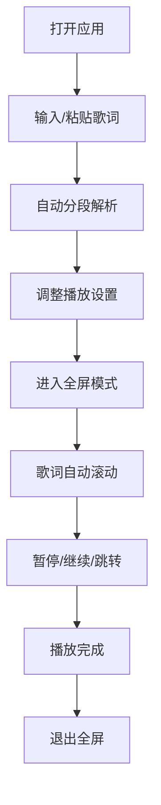

## 1. 产品概述

歌词提词器是一款专为歌手、音乐人及演唱爱好者设计的网页应用，解决唱歌忘词的尴尬问题。通过大尺寸全屏滚动播放歌词，支持速度调节、暂停播放和段落跳转，提供纯黑护眼背景，适合日常练歌或舞台演出使用。

## 2. 核心功能

### 2.1 用户角色

| 角色 | 注册方式 | 核心权限 |
|------|----------|----------|
| 普通用户 | 无需注册 | 输入歌词、播放控制、全屏显示 |

### 2.2 功能模块

1. **首页**：歌词输入区、播放控制区、设置面板
2. **全屏播放页**：歌词滚动显示、进度指示、快捷控制

### 2.3 页面详情

| 页面名称 | 模块名称 | 功能描述 |
|---------|----------|----------|
| 首页 | 歌词输入区 | 粘贴/输入歌词文本，支持手动换行，自动分段解析 |
| 首页 | 播放控制区 | 开始播放、暂停/继续、上一句、下一句按钮 |
| 首页 | 设置面板 | 滚动速度滑块、字体大小调节、对比度设置 |
| 全屏播放页 | 歌词滚动区 | 文字从下往上平滑滚动，当前行高亮显示 |
| 全屏播放页 | 进度指示 | 显示当前段落序号、总段落数、进度百分比 |
| 全屏播放页 | 快捷控制 | 鼠标悬停显示半透明控制栏，支持键盘快捷键 |

## 3. 核心流程

用户打开应用 → 粘贴或输入歌词 → 调整速度和字体设置 → 点击全屏播放 → 歌词自动向上滚动 → 通过键盘或控制栏暂停/跳转 → 播放完成退出全屏

## 4. 用户界面设计

### 4.1 设计风格

- **主色调**：纯黑色背景 (#000000)，护眼设计
- **文字颜色**：白色/浅灰色，高对比度确保可读性
- **高亮色**：当前行使用暖白色或淡黄色突出显示
- **按钮样式**：极简圆形按钮，半透明背景，悬停时加深
- **字体**：使用无衬线字体，大号字体，行高宽松
- **布局风格**：全屏沉浸式，边缘留白，居中显示
- **图标风格**：简洁线性图标，统一线条粗细

### 4.2 页面设计概述

| 页面名称 | 模块名称 | UI 元素 |
|---------|----------|----------|
| 首页 | 歌词输入区 | 大尺寸文本框，占位符提示，字数统计 |
| 首页 | 控制区 | 圆形播放按钮，速度滑块带数值显示 |
| 全屏播放页 | 歌词显示区 | 超大字号，行间距宽松，当前行高亮动画 |
| 全屏播放页 | 控制栏 | 底部半透明浮动栏，包含进度条和控制按钮 |

### 4.3 响应性

- **桌面端优先**：优化大屏显示效果，充分利用屏幕空间
- **移动端适配**：自适应屏幕宽度，触摸友好的按钮尺寸
- **键盘快捷键**：空格暂停/播放，左右方向键跳转段落，ESC退出全屏

### 4.4 动画与交互

- 进入/退出全屏时的平滑过渡动画
- 歌词滚动的线性缓动效果
- 当前行切换时的淡入高亮
- 控制栏的悬停渐显效果
- 滑块调节时的实时反馈
