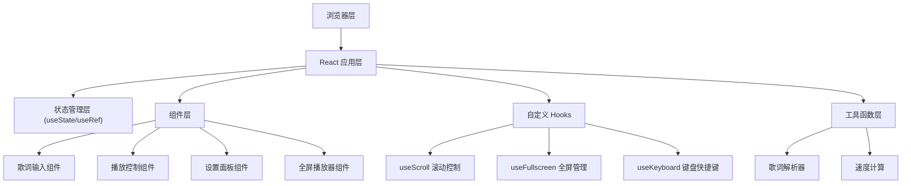

## 1. 架构设计



## 2. 技术描述

- **前端框架**：React@18 + TypeScript + Vite
- **样式方案**：TailwindCSS@3
- **构建工具**：Vite@5
- **状态管理**：React Hooks (useState, useRef, useEffect)
- **动画方案**：CSS Transform + requestAnimationFrame
- **后端**：无（纯前端应用）
- **数据存储**：LocalStorage 保存用户偏好设置

## 3. 目录结构

```
src/
├── components/
│   ├── LyricInput.tsx      # 歌词输入组件
│   ├── PlayControls.tsx    # 播放控制组件
│   ├── SettingsPanel.tsx   # 设置面板组件
│   ├── FullscreenPlayer.tsx # 全屏播放器组件
│   └── ProgressBar.tsx     # 进度条组件
├── hooks/
│   ├── useScroll.ts        # 滚动控制 Hook
│   ├── useFullscreen.ts    # 全屏管理 Hook
│   └── useKeyboard.ts      # 键盘快捷键 Hook
├── utils/
│   ├── lyricParser.ts      # 歌词解析工具
│   └── speedCalculator.ts  # 速度计算工具
├── types/
│   └── index.ts            # 类型定义
├── App.tsx                 # 主应用组件
├── main.tsx                # 入口文件
└── index.css               # 全局样式
```

## 4. 核心数据结构

```typescript
// 歌词段落
interface LyricLine {
  id: string;
  text: string;
  index: number;
}

// 播放状态
interface PlayState {
  isPlaying: boolean;
  currentLineIndex: number;
  progress: number;
  scrollTop: number;
}

// 用户设置
interface UserSettings {
  scrollSpeed: number;      // 1-10
  fontSize: number;         // 24-72px
  lineHeight: number;       // 1.2-2.0
  highlightColor: string;
  textColor: string;
}

// 应用状态
interface AppState {
  lyrics: LyricLine[];
  rawLyrics: string;
  playState: PlayState;
  settings: UserSettings;
  isFullscreen: boolean;
}
```

## 5. 核心功能实现方案

### 5.1 歌词解析
- 输入文本按换行符 `\n` 分割
- 空行作为段落分隔符
- 自动过滤首尾空白字符
- 为每一行生成唯一 ID

### 5.2 滚动实现
- 使用 CSS `transform: translateY()` 实现平滑滚动
- 通过 `requestAnimationFrame` 控制滚动帧率
- 滚动速度 = 基础速度 × 用户设置的速度系数
- 当前行检测：根据滚动位置计算当前显示的行

### 5.3 全屏模式
- 使用浏览器 Fullscreen API
- 进入全屏时隐藏所有非必要 UI
- 鼠标静止 3 秒后自动隐藏控制栏
- 键盘快捷键支持

### 5.4 本地存储
- 自动保存用户设置到 LocalStorage
- 页面加载时恢复用户偏好
- 可选保存最近输入的歌词

## 6. 性能优化

- 使用 `useMemo` 缓存解析后的歌词数据
- 使用 `useCallback` 避免不必要的函数重建
- 滚动动画使用 CSS transform 启用 GPU 加速
- 避免在滚动回调中频繁触发重渲染
- 虚拟滚动：只渲染可视区域附近的歌词行
